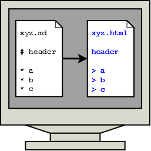
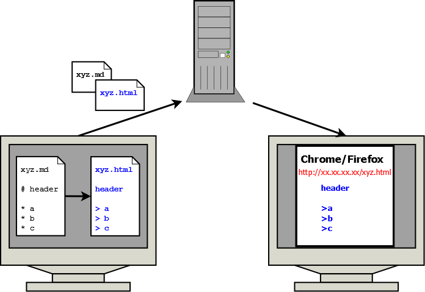
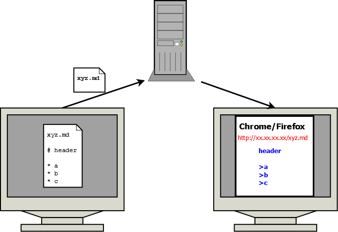
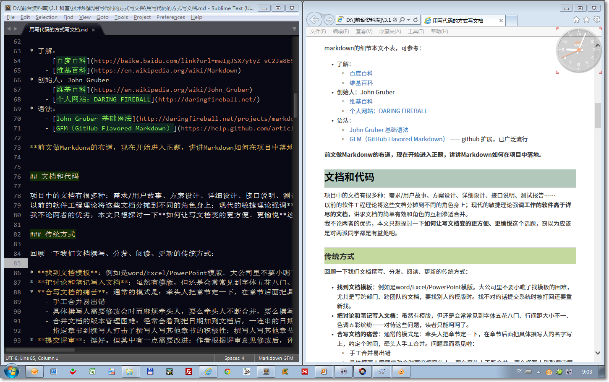
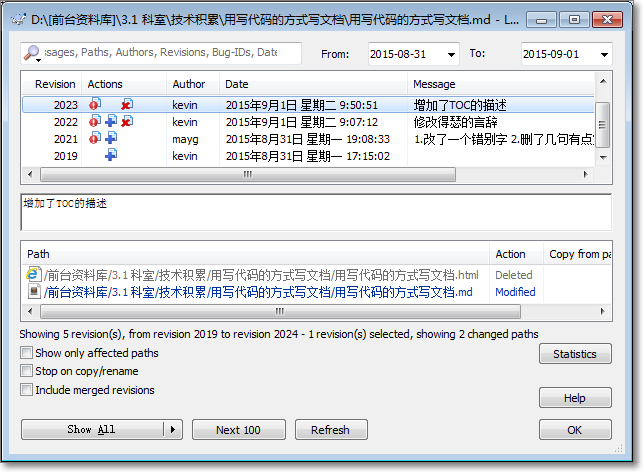
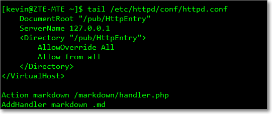
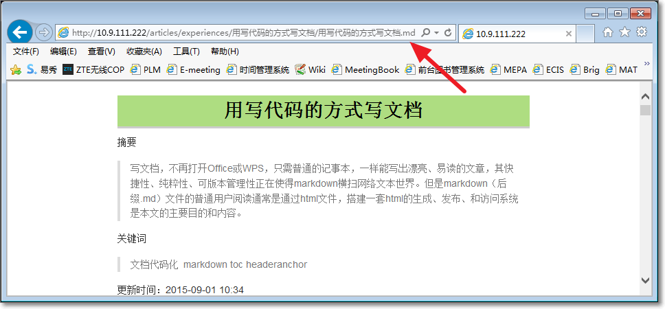

摘要

> 本文旨在说服工程师们，尤其是敏捷团队的成员，在撰写过程文档时，放弃传统方式，尝试使用：1、Markdown 撰写；2、SVN/Git 版本管理；3、HttpServer 排版；—— 3 合 1 的新方式。  
> 本文也描述了相关的技术要素：如何不再打开 Office 或 WPS，只需普通的记事本，一样写出漂亮、易读的文章；如何搭建一套 Markdown->html 的生成、发布、和访问系统；如何使用浏览器快捷、永久的访问文档……

关键词

> 文档代码化
> markdown
> toc
> headeranchor

特别说明

> 本文即是使用本文所描述的方式撰写，所以截图和文字中会看到本文自己的映射，如果让你感到了些许盗梦空间般的费解，还望谅解。

<!-- MarkdownTOC -->

更新时间：2015-09-23 11:45

- [理论篇](#理论篇)
  - [文档的传统方式](#文档的传统方式)
  - [文档的新方式](#文档的新方式)
  - [文档的代码化](#文档的代码化)
- [实现篇](#实现篇)
  - [Markdown 基础](#markdown-基础)
    - [标记语言与 Markdown](#标记语言与-markdown)
    - [Markdwon 工具软件](#markdwon-工具软件)
  - [工作流](#工作流)
    - [个人工作流](#个人工作流)
    - [团队工作流](#团队工作流)
  - [一些技术细节](#一些技术细节)
    - [书写 markdown](#书写-markdown)
    - [HttpServer 动态编译 Markdown 的实现](#httpserver-动态编译-markdown-的实现)
    - [为 Markdown 增加目录(TOC)](#为-markdown-增加目录toc)
- [读者交流](#读者交流)
- [附录](#附录)
  - [SublimeText 的基本使用](#sublimetext-的基本使用)

<!-- /MarkdownTOC -->

# 理论篇

项目中的文档有很多种：需求/用户故事、方案设计、详细设计、接口说明、测试报告……  
以前的软件工程理论将这些文档分摊到不同的角色身上；现代的敏捷理论强调**工作的软件高于详尽的文档**，讲求文档的简单有效和角色的互相渗透合并。  
本文不论两者的优劣，只想探讨一下**如何让写文档变的更方便、更愉悦**这个话题，窃以为应该是对两派同学都是有益处吧。

## 文档的传统方式

回顾一下我们文档撰写、分发、阅读、更新的传统方式：

- **找到文档模板**：例如是 word/Excel/PowerPoint 模版。大公司里不要小瞧了找模板的困难，尤其是写跨部门、跨团队的文档，要找别人的模版时。找不对的话提交系统时被打回还要重新找。万一遇到了模版更换 Logo 一类的事情，用提心吊胆来形容有时候都不过分。
- **把讨论和笔记写入文档**：虽然有模版，但还是会常常见到字体五花八门、行间距大小不一、色调五彩缤纷……对待这些问题，读者只能呵呵了（本文如果哪天写入了某个 Word 模版，肯定也是个鬼样）。
- **合写文档的痛苦**：通常的模式是：牵头人把章节定一下，在章节后面把具体撰写人的名字写上，约定个时间，牵头人手工合并。问题显而易见啦：
  - 手工合并易出错
  - 具体撰写人需要修改时会去麻烦牵头人，要么牵头人不断合并，要么撰写人采取保守策略不再积极提交变更
  - 合并文档的版本管理困难：经常会看到把日期加到文档后，一连串的日期把自己累的不行
  - **“指定章节到撰写人”**打击了撰写人写其他章节的积极性：因为会给合并人带来更多的工作和混淆，撰写人宁可保持低调；同时撰写人并不知道另一章节的人是否已经撰写了自己想到的内容。
- **提交评审**：挺好。但其中有一点需要改进：作者根据评审意见修改后，通常有两种方式评判是否 OK：主持人直接评判，主持人开会召集评委们再次评判。—— 在一个温和的团队中，这两种方式都会“和谐”的完成。可以增加第 3 种意见表达的方式：**评委直接修改文档**，然而在 word 模版+没有版本管理的方式下，这是令人望而却步的。
- **更新文档**：最痛苦的部分到了
  - 需求、方案类文档：开发实现后回头更新需求、方案的比例有多高？这个现实问题很多同学宁可提都不提， Let it go，随她吧。
  - 详设、开发类文档：软硬件工程师们拿各种理由来搪塞的场景相信都遇到过吧，什么“来不及”了、“太多了”、“更新太快了”……甚至还有“代码即文档”这种左倾冒险主义的托辞不一而足。面对领导燃烧的怒火，工程师们用微笑和耸肩来抵挡。
  - 测试、报告类文档：这个还好，因为是一次性活动的文档产物，基本不需要更新。《测试方案》归属到第一类中。
  - 其他：技术积累、会议纪要等过程文档，细想想更恐怖，几个月前讨论的会议纪要你还会打开么？到哪里找估计都忘了吧，那次会议中的决议还记得么？上次调试遇到的挫折写入技术积累了么？…… 呀呀呀，不要再说了。呵呵。
- **更新后文档的推送**：有几种方式
  - 第一次你是通过邮件、聊天软件把文档发给读者的，更新后的文档则需要重发一次，如果你一个月更新一次还好，如果一周更新一次呢？一天呢？
  - 文档在某某系统中归档的：这就要依赖与该系统是否好用、方便了。如果想读一个文档要进入系统中能够快速找到，Good；如果需要多次跳转、或者要掌握什么奇技淫巧才行，就又要呵呵了，就是这次进去找到了，下次可能又找不到了。—— 在某某系统中迷过路的小伙伴请举下手。

上面这些如果有哪条戳中了你的痛点，请继续往下读。如果你觉得没关系啦，这些都是小事，鸡毛蒜皮的，我们团队可以克服，那还请点击右上角（Fedora/Ubuntu/Mac 请点击左上角）的叉，谢谢。

## 文档的新方式

现在，我们来试想一下某种新的方式：

---

1. **写作和排版是分离的**：作者只关心内容和简单的排版（如标题、分段、列表），不关心最终的排版布局、字体色调等表现形式（如颜色、字体、行间距……），类似书籍出版业：作者只需要把内容写在稿纸上或 txt 文本，编辑去完成排版和书籍的美工。这样带来的优点很多：
   - **作者**专注于写内容、表达思想
   - **编辑**可以使得表现形式很容易统一
     - 一个公司、一个部门、或一个团队可以方便的制定自己的渲染方式，写作的人可以不必关心。
     - 更换 Logo 这种事情只需要编辑一个人搞就是了
   - **编辑**不是人，是软件、电脑：
2. **多人合写、协作是非常方便的**：每个人的观点和想法可以方便的在团队中流动，关键是可以被记录在文档中，而不是散落在邮件里。
   - 每个人可以即时、及时的对文档中的内容表达意见。
   - 团队中每个人都可以即时的收到文档被更新的通知，而且不需要撰写人发邮件通知，尤其在撰写人是多人的时候更加有效。
3. **写作是简文本形式的**：随时、随处、随编辑器可打开、编辑，再也不会出现在一个没有安装 Office 的电脑上打不开一个 word 文档、打开文档后一个 visio 图是个红色叉叉……的囧境。
4. **文档更新历史信手拈来，毫厘不差**：不必人工更新文档中的某个叫做“更新历史”的章节，而是能够方便的看到该文档的所有参与人、参与时间、和修订内容。——这可不是 word 的修订模式能够完成的。
5. **通过浏览器访问文档**：打开 IE/Chrom/FF，访问网址既能看到最新的文档，收藏到收藏夹中时不时看看，甚至可以进行 RSS 订阅 —— 这种阅读体现还不能打动你么？

---

OK，几大梦想如何来实现呢？非常方便，我们现在所处的互联网时代早就搞定这些事情了，并且是非常简单、高效，需要的只是你勇敢的去尝试、然后喜欢。

- **使用 Markdown 等标记类语言来写简文本文档**：编辑器很多，可以参考下文“工具软件”章节，此处我推荐 SublimeText，Win/Mac/Linux 全系统通用，适当的加上各种插件，写什么都特有感。
- **使用 SCM(svn、git 等)管理简文本文档**：并不是什么都能用 SCM 管理，至少软件版本、压缩包、视频、甚至图片……这些二进制的东西都是不能交给 SVN、git 来管理的，倒不是 scm 不能管理，而是你在做不对的事情，就像非要一个软件工程师去画一块电路板，不是他做不出来，而是你用人不当。简文本是 svn/git 最能接受的，并且好处多多：
  - 多人合写文档：在 svn/git 提交就是了，update 一下，然后 commit，什么牵头人、合并人都不再需要了
  - 修改别人的章节：update 后，修改就是了，提交后能方便地看到修改了啥，还能回退
  - 促进文档更新：能看到 log 和每次更改的记录，就像一个成绩肯定，会建立作者的成就感，越是不断更新文档的人，看着自己的更新 log，越是更充满再更新一下、再完美一点的冲动。
  - 对开发工程师没抵触：当前的开发工程师 99%都已经熟练的掌握了 svn 或 git 的使用，剩下 1%可能还在使用 cvs 或 clearcase。所以问题是如何让系统工程师、测试工程师等其他人员也掌握 svn 或 git 这种可以 1h 入门速成的好工具（git 的精通还是需要更多的时间和实践，svn 则基本没有精通的必要了）。
  - 简文本对 SVN/git 服务器的负荷是很小的 —— 这点对服务器管理员是深有感触的，看着 SVN 库日渐庞大，总有种忧心忡忡的感觉。这是因为前文说的哪些不适合 svn 管理的文件被提交所致，它们不能被有效压缩，不能做增量存储……看 Linux 的 Kernel 源码 git 库：10 多年的所有历史数据（每一次提交、每一个分支……）在服务器上才 1.7G，因为它坚持一个原则：不提交二进制文件，不提交富文本文件，一切都是简文本。
- **配置 HttpServer 完成编辑角色**：Markdown 撰写的文档当然也可以在本地静态编译成 html，自己查看，或分发给朋友，但这样做的缺点是把编辑工作自己承担了，后果就是模版不统一，这种团队中不可取。由 HttpServer 中加 Markdown 渲染插件：把编辑工作交给服务器是更好的选择。
- **加入权限控制**：svn、httpserer 都可以进行权限控制，控制某些人不能提交或阅读。

总结一下：回头一看，你会发现，这不就是写代码么？做软件的都懂这个。—— 就是，就是，就像写代码一样来写文档，对软件工程师简直是零门槛，呵呵。

## 文档的代码化

这里需要首先分辨出两个概念：

1. **代码的文档化**：是对工程师的期望，期望软硬件工程师写出的代码是尽量不需要外部文档的，或能够自动生成文档的。
   - 尽量不需要外部文档：
     - 加强有价值的注释：这个对大部分工程师都是不抵触的
     - 书写更易读的源码：有意义的变量/函数命名、更合理的函数原子分解、避免奇技淫巧的语法使用……
   - 自动生成文档：按照某种语法书写注释，编译时使用 Doxygen 等工具自动生成注释。对内部接口可能作用不大，但对模块间接口和对外服务接口，自动生成文档非常重要和必要，甚至可以说，不是自动生成的文档都是不能用的文档。
2. **文档的代码化**：是对所有写文档人的期望，期望所有写文档的人能够掌握 svn/git 等工具，采用简文本格式书写文档，适当加入**标记类语言**，克服传统文档书写、合并、发布、更新过程中的痛点，写出喜闻乐见、快速迭代、有效传播的文档。

代码文档化是另外一个课题，本文不表。

文档代码化是本人提出的新名词，百度上暂时还搜不到，提出这样的名词主要还是为了促进更多的人改进原有的文档编写方式。

那么文档代码化除了**个人胸怀&态度**和**接受新事物的能力**两点阻力之外，还有没有其他的困难呢？当然有：

- 并不是所有文档都适合代码化：正式严肃、需要加密、红头文件之类的应该更适合使用传统方式，对文档更新不要求、甚至限制其更新的文档更适合使用传统方式。
- markdown 标准在不断演化中，并且已经开始有分支能够强力到影响创始人的决策
- markdown 的**编辑工具**虽然好找，但**编译工具**并不是很统一
  - 对扩展语法的编译不一致，尤其是对页内跳转、TOC 等标准的实现
  - 本地编译和 HttpServer 访问时编译的实现难度不一样
    - 对个人：本地编译，直接传给读者 html 文件即可
    - 对团队：建议是只向 svn/git 上传 markdown 文件，不编译，而是在读者访问 httpserver 时即时编译。

下面开始解决上面的几个小困难 —— 说实话这些对软件工程师不算困难，有 N 多的开源项目可以拿来主义，但对其他团队有可能是个不大不小的困难，还是描述一下吧。

# 实现篇

## Markdown 基础

**熟悉、已经会使用 markdown 的同学请跳过本章节。**

### 标记语言与 Markdown

计算机的可读文本记录有两种：简文本方式、富文本方式

| 特性                  | 简文本方式                                                                     | 富文本方式                                                  |
| --------------------- | ------------------------------------------------------------------------------ | ----------------------------------------------------------- |
| 编写工具              | 普通文本编辑软件 如：记事本、vi/vim、sublime 等                            | 各自特定的编辑软件 如：office、WPS 等                   |
| 存储空间              | 小                                                                             | 大                                                          |
| 版本管理 SVN、git | Server 上可压缩，支持增量存储 存储空间极小 Client 支持方便的对比等功能 | Server 上不支持增量存储，占空间 Client 大部分不支持对比 |
| 举例                  | .txt/.c/.sh/.xml/.html/……                                                      | .doc/.ppt/.xls/.rtf/……                                      |

两者各有优缺点，长期以来互补而不能互相替代。

但是到了网络时代，移动阅读日渐成风，追求简洁阅读，随之也带动桌面阅读一起，都在向“扁平化、去拟物、沉浸式”发展，富文本的丰富似乎变得可有可无（其实本来 word 的丰富表现力又有几人会用？80%的人群只用了富文本编辑工具的 20%功能，其实是另外 80%的功能变得可有可无）。

有没有结合两者优点：简文本书写、（小）富文本表现的产物呢？—— 有：[标记语言（markup language）](http://baike.baidu.com/link?url=3GzfuHb4Jk3cToXhuPcoDa_wBRX93w6IrzG1yCFa4ArJaxa9FlJxcIMLzi8zQhIxMX5AeLwxZGn1vJmySpsQGK)，在文本中插入格式描述。

其实并不是近几年才开始有人关注两种文本的融合，标记语言也已经发展了很多年，也不止一种：

- TeX
- XML
- Markdown
- DocBook

都是在文本中插入格式描述，孰优孰劣暂且不表，这里只说一个：随着 github 的风靡而在广大程序直男中迅速普及的：**markdown**。

markdown 的细节本文不表，可参考：

- 了解：
  - [百度百科](http://baike.baidu.com/link?url=mwIgJSX7ytyZ_vC2Ja8E5TczqtcquCgMK6HWIGLkfdPC3QFyBaSEEnYfuhTeSAdkkzN8kwfQfnceVnflUV53iK)
  - [维基百科](https://en.wikipedia.org/wiki/Markdown)
- 创始人：John Gruber
  - [维基百科](https://en.wikipedia.org/wiki/John_Gruber)
  - [个人网站：DARING FIREBALL](http://daringfireball.net/)
- 语法：
  - [John Gruber 基础语法](http://daringfireball.net/projects/markdown/)
  - [GFM（GitHub Flavored Markdown）](https://help.github.com/articles/github-flavored-markdown/) —— github 扩展，已广泛流行

### Markdwon 工具软件

我本人对比试用过的几款如下表。列出来只是想给大家多一些选择，如果有选择恐惧症的同学，跳过本节，参考[附录 1:SublimeText 的基本使用](#sublimetext)，使用 SublimeText + MarkdownEditor + MarkdownPreview 即可。

| Name                          | OS            | LivePreview | TOC | VI  | OpenSource                 |
| ----------------------------- | ------------- | ----------- | --- | --- | -------------------------- |
| [Haroopad][haroopad]          | Mac Win Linux | Yes         | Yes | Yes | No                         |
| [Mou][mou]                    | Mac           | Yes         | No  | No  | No                         |
| [MarkdwonPad][markdownpad]    | Win           | Yes         | No  | No  | No                         |
| [CuteMarkEd][cutemarked]      | Win Linux     | Yes         | No  | No  | [Github][cutemarked]       |
| [SublimeText+plugin][sublime] | Mac Win Linux | No          | Yes | Yes | No                         |
| [Cmd][cmd]                    | Web           | Yes         | Yes | Yes | No                         |
| [stackedit][stackedit]        | Web           | Yes         | Yes | No  | [Github][stackedit-github] |
| [MaHua][mahua]                | Web           | Yes         | No  | Yes | No                         |

点评

- Haroopad：偶然发现的通吃、美观、功能强悍的全能型选手
- Mou：好久没升级了，又听说作者正在考虑出售，看来已经日落西山了。
- MarkdownPad：基于.NET Framework4.0，启动稍显慢，其他都挺好。
- Sublime Text + Plugin：强烈推荐，取代了我 Windows 上的 Notepad++，Fedora 上的 gedit，和 Mac 上的 TextEdit，以 1 抵 3。其实 VI 也能做到以 1 抵 3 的，VI 也有 Markdown 插件，但 Sublime 有 VI 模式，但 VI 没有 Sublime 的很多特性，只能说：VI 加油！

[haroopad]: http://pad.haroopress.com/user.html#download
[mou]: http://mouapp.com
[markdownpad]: http://markdownpad.com/
[cutemarked]: https://github.com/cloose/CuteMarkEd
[sublime]: http://www.sublimetext.com
[cmd]: https://www.zybuluo.com/mdeditor
[stackedit]: https://stackedit.io
[stackedit-github]: https://github.com/benweet/stackedit
[mahua]: http://mahua.jser.me

## 工作流

### 个人工作流

### 团队工作流

**工作流 1：**

1. 书写 markdown 文档
2. 本地编译为 HTML
3. markdown 文档和 HTML 同时上传到 svn/git 服务器
4. 读者通过权限受控的 http 访问 svn 服务器上的 html 文件到
5. 撰写人更新文档，需重新本地编译，上传 markdown 和 html 文档

**工作流 2：**

1. HttpServer 管理员配置好服务器可以动态编译 Markdown
2. 本地书写 markdown 文档
3. 仅上传 markdown 文件到 svn/git 服务器
4. 读者通过权限受控的 http 访问 svn 服务器上的 markdown 文件，动态转换为 html
5. 撰写人更新文档，仅上传 markdown 即可

对比两种工作流：

- SVN 服务器的配置两者都是需要的，但 SVN 服务器有两种协议： http:// 和 svn:// 如果你的团队使用的 http:// ，那么恭喜你，省区了很多工作；如果是 svn:// ，那么如果想网页访问服务器上的文件，还需要配置 apache。
- 工作流 1 的服务器上不需要 markdown for apache 插件，工作流 2 需要。—— 工作量上：虽然看似 2 比 1 在服务器上多了一些工作量，但其实与 1 比 2 在个人电脑上多的工作量，简直是云泥之别。模版统一性方面：由于每个人本机转换 markdown 的方式可能有所不同，工作流 1 的 HTML 最终是不统一的，不能解决我们前文中模板困惑中的问题，2 集中在服务器上做转换则轻松解决。
- 工作流 2 由于本地不编译，所以对撰写人所用的电脑要求低（不必下载安装 Markdown 的编译工具或插件） —— 看似是件小事，但它**使得在别人的电脑上改自己的文档成为可能。**

综上，我建议采用工作流 2。

下面，我们来描述一下重点的几个技术细节，让大家顺利的操作工作流。

## 一些技术细节

### 书写 markdown

这是萝卜白菜的问题，无论你用 windows 记事本、vi、还是锤子便签，我都是支持的，上一张图看看把：

**sublime 中畅快的书写和预览 markdown**

**通过 SVN 来合并、更新文档，并查看修改记录，快捷追溯**

### HttpServer 动态编译 Markdown 的实现

HttpServer 的 Markdown 转换插件还是不难找的，无论是 IIS 还是 Apache，比如 Apache 上有：

- https://github.com/sminnee/markdown-handler.git
- https://github.com/erusev/parsedown

**配置 Apache 识别.md 文件**

配置完后就可以这样访问 md 文件了：`http://xxx.xxx.xxx.xxx/ReadMe.md`。

比如本文：[http://10.9.111.222/articles/experiences/用写代码的方式写文档/用写代码的方式写文档.md](http://10.9.111.222/articles/experiences/用写代码的方式写文档/用写代码的方式写文档.md) —— 如果你阅读的是 word 版，不妨阅读一下网页版，与 word 相比，会经常更新的哦。

**通过浏览器访问.md 后缀的 Markdown 文件**(截图中为本文的[网络地址](http://10.9.111.222/articles/experiences/用写代码的方式写文档/用写代码的方式写文档.md))

### 为 Markdown 增加目录(TOC)

为文档生成一份目录，并且能够页内跳转，富文本文档都是能轻松实现的，也是非常有必要的。Markdown 最初没有，后来加上了。

TOC 语法标准：https://pythonhosted.org/Markdown/extensions/toc.html

其中涉及两个概念：

1. 在 Markdown 文本中增加目录，即**TOC 的生成**：可以使用 submlime 的 MarkdownTOC 插件
2. 生成 HTML 时，为每一级标题（Header）生成出页内跳转点（或称为：锚点），即**HeaderAnchor 的生成**：
   - 使用 MarkdownPreview 生成的本地 HTML 具有标准的 HeaderAnchor
   - 使用 parsedown 生成的动态 HTML，暂时没有。自己动手修改了一下吧，PHP 写的，然后还可以贡献给原作者。如果对 PHP 不太熟悉，百度一下学学也就半天时间。如果没学过软件，就直接到[我的 github](https://github.com/wkevin/parsedown)上取一下也行

如果觉得“为 markdown 生成 TOC 和 Headeranchor”是个烧脑和虐心的事情，完全可以不理这茬儿，因为也可以在 apache 上配置直接生成 TOC+Headeranchor 的插件（也许过不久，parsedown 就有这功能了），CSDN 的博客系统已经实现了，可以去参观学习。

# 读者交流

随着本文被越来越多的读者讨论，一些有趣的问题我也很想收录一下。

> 【问】让大家放弃原有的方式是对惯性思维和惯性操作做斗争，你有什么好办法？  
> 【答】布道者的手法、口才和热心很重要，布道者要懂得用最有力的工具（比如微信公众号）来推广自己认为有价值的东西，布道者需要写出更能打动人的文章和言辞。但最重要的是，需要打破惯性的人自己，他的内心如果是禁闭的，他的眼睛如果不肯张开，谁也没有办法，即使像 markdown 这样简单到不如乘法口诀表难度的东西。

-

> 【问】Markdown 的学习门槛如何让大家突破？  
> 【答】Markdown 可以用 10 分钟速成，几乎没有学习门槛，工作流才有门槛。如果 Markdown 只是个人使用（即个人工作流，没有服务器配置的工作），下载一款软件，写文档的时候用上几个符号（`#、*、**、、`）就足够了。  
> Markdown 是把匕首，Office 是挺机枪，用什么取决于你要执行的任务，别搞的只会用枪不会用匕首，不要说“枪都会用了还学什么用匕首”的鬼话，更要防止某些连枪都用不好却也不学用匕首……

-

> 【问】如何保证大家都切换到 markdown，而不是一些人用，一些人不用，会更糟。  
> 【答】WOO！这个问题我不好回答了，Github 上的一刀切可以参考，但人家是 MinZhu 社会，一切行为靠市场去调节，我们这里如果一刀切的话，倡导切的人肯定要被“调节”，场景不同。另外，这种问题布道者难以回答的另一个原因是：牧师有教会支持，党员有党团支持，技术布道者只有热情去支持，热情--只能感染身边小众，除非你是 stallman 之流。

# 附录

## SublimeText 的基本使用

一定要分清标记类语言的：编辑器和编译器。Sublime 只是编辑器，MarkdownEditor 和 MarkdownTOC 是编辑器辅助插件，MarkdownPreview 是编译插件。

**安装**

- **安装软件**：[官网][sublime] 发布安装包和绿色免安装包，区别是：用户数据（包括：自己安装的插件、缓存、配置等）
  - 安装版在：C:\Users\Administrator\AppData\Roaming\Sublime Text 3\
  - 免安装版：运行目录\Data\
  - 所以免安装版打个包就能传给另一台电脑使用了，所有用户数据都在，非常方便
- **安装插件**：
  1. 首先安装[Package Control](https://sublime.wbond.net/)，
  2. 然后`Ctrl+Shift+P`
  3. 输入`install package`
  4. 分别输入插件的名字,如本文后面推荐的：`MarkdownEditor` 、 `MarkdownPreview`、`MarkdownOC`

**基本操作**

- Goto
  - （搜索后）跳转
    - 跳转到文件：**Ctrl + P**：
    - 跳转到 symbol：**Ctrl + P，`@`**，或 **Ctrl + R**
    - 跳转到 word：**Ctrl + P，`#`**，或 **Ctrl + ;**
    - 跳转到 line：**Ctrl + P，`:`**，或 **Ctrl + g**
    - 跳转到 定义：**F12** —— ST3 中新增，需要文件首先加入到 project 中
  - 向回和向前跳转：**Alt + `-`** 和 **Alt + Shift + `-`**
  - 文件切换
    - Tab 直接定位：**Alt + 1/2/3/...**
    - Tab 间切换：**Ctrl + PageDown/Up**
    - 头文件和源文件之间切换：**Alt + O**
- Select
  - Multiple Selections（多重选择）
    - **Ctrl + 鼠标左键**：同时在多个地方放置光标，然后可进行同时的修改、删除等
    - **Ctrl + D**：选中相同的 word
      - 依次 **Ctrl + D**，选中每一个想要的，然后可进行同时的修改、删除等
      - 遇到某个不想要的，用 **Ctrl + K** & **Ctrl + D** 跳过
      - 取消选定：**Ctrl + U**
    - 上述两种操作也可以组合使用：先 Ctrl+D，在 Ctrl+左键选……
  - Column Selection
    - Windows： **Ctrl + Alt + Up/Down**，或者**Shift + 右键拖动**
    - Linux： **Alt + ⇧ + Up/Down**
    - OS X： **⌃ + ⇧ + Up/Down**
- Tools
  - Command Pallete（命令操作）：**Ctrl + Shift + P**，[官方文档](http://docs.sublimetext.info/en/latest/reference/commands.html)

**配置**

- Preferences --> Settings
  - 切换到 vi 模式
    - Setting-Default：拷贝 `"ignored_packages": ["Vintage"]` —— Default 是修改不了的
    - Setting-User：粘贴为 `"ignored_packages": [ ]` —— User 的设置会覆盖 Default
    - 基本的字符、搜索、行、列……操作都是使用 vi 的快捷键实现，就不去再记忆一份 ST 的快捷键了
- command、Keybinding、macro ——三者是关联的。
  - command
    - wiki: http://sublime-text-unofficial-documentation.readthedocs.org/en/latest/reference/commands.html
    - 官方（不全）： https://www.sublimetext.com/docs/commands
  - key bindings
    - 书写格式： http://sublime-text-unofficial-documentation.readthedocs.org/en/latest/reference/key_bindings.html?highlight=keys
  - macro
    - 书写格式： http://sublime-text-unofficial-documentation.readthedocs.org/en/latest/extensibility/macros.html?highlight=macro
    - macro 的一个缺点：宏只能识别 Text Commands，不能识别很多 command，比如 `show_overlay`

**Plugin**:  
Sublime 的插件非常多，下面除`Package Control`之外，介绍 5 个最必须的。

- Package Control: https://sublime.wbond.net/ 下面各种插件的基础、管家
- Markdown 类
  - **Markdown Preview**：https://sublime.wbond.net/packages/Markdown%20Preview
    - Preview：两种方式
      1. `cmd+shift+P`：
         - Markdown Preview: Preview in Browser
         - Markdown Preview: Export HTML in Sublime Text
         - Markdown Preview: Copy to Clipboard
         - Markdown Preview: Open Markdown Cheat sheet
      2. `Ctrl+B`(Windows/Linux) or `cmd+B`(Mac)： build current file 到当前目录，并且名字相同，后缀改为 .html
    - Config
      - "css": "E:/kevin/kknowledge/src/CSS/markdown.css",
      - "image_path_conversion": "none", —— 不要把图片的相对地址转换为绝对地址，否则本地路径就进去了，非常不好
      - "file_path_conversions": "none", —— 同上
      - "path_tempfile": "./", —— `cmd+shift+P`生成的临时 html 文件地址，该临时文件名为随机
      - "enable_autoreload": false, —— save 的时候是否 build，true 的话 save 会很慢
  - **Markdown Edit**
    1. Provides a decent Markdown color scheme
    2. 加快文件的操作
       - Pair 操作
         - 输入一对的首，自动加入尾；
         - 输入首后前删首，自动删除尾；
         - 输入首后空格，自动删除尾；
       - 列表的支持
         - 列表的编辑中，回车自动加入列表项
         - `Tab` 和 `Shift Tab` 列表级别增加一级、减少一级
       - `~` wraps selected text with ~~ (strikethrough)
  - **MarkdownTOC**：安装后操作： `菜单Tools -- MarkdownTOC -- insert`
- 字符编码类：SublimeText 新建、保存默认都是 UTF-8，所以只存在这样两种动作：其他编码格式的文件打开时没有被正确识别 —— 需要 repon 或 reload；无论当前打开的文件是什么编码，我想保存为一种我指定的格式 —— save with 或 set file encoding to。
  - **EncodingHelper**：官方出品，菜单中会增加 **reopen/save with encoding**，但缺少 ANSI（GBK、GB2312……）的支持
  - **ConverToUTF8**：中国的同学补充，菜单中会增加 **Set File encoding to/Reload with encoding**，不过名字容易让人困扰，改为 **EncodingHelperWithANSI** 更合适些
