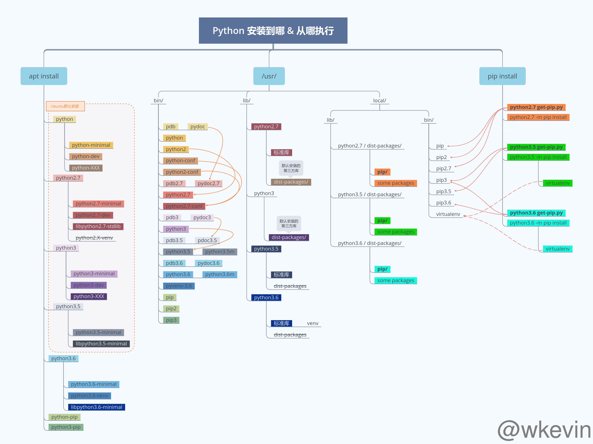

摘要：

- python 强烈建议一律使用虚拟环境，在原生操作系统上几乎无法管理多个项目有包依赖关系冲突的情况。
- 操作系统级只安装最基础包，且使用`python3.X -m pip install`来安装，虚拟级 source 后可直接`pip install`。

虽然一直都用虚拟环境，但还是想把系统安装的 python 路径整理一下，今天了结这个心愿。

<!--truncate-->

**说明:**

- 上图只体现 Ubuntu 系统级的 python，虚拟环境的没在图中体现。
- 图片大致可分左右两部分：
  - 左边用颜色表示：`apt install` 的 python 和 package 都在哪里
    - `apt install`的算系统级，文件都在 `/usr/[bin|lib]`
  - 右边用另一套颜色和线条表示：`pip install` 到系统路径下的 package 在哪里
    - `pip install`的算用户级，所以都在 `/usr/local/[bin|lib]` 下

**下面就 4 个典型动作给出辨析和推荐：**

### python 命令

| 命令          | 属性 | 辨析                                                                                                         |
| ------------- | ---- | ------------------------------------------------------------------------------------------------------------ | --- | ----------------------------------------------------------------------------------------------- |
| `$ python`    | link | /usr/bin/python 可能指向： 1. `update-alternatives --config`配置的某个目标 2. 系统 su 配置的某个目标 |     |
| `$ python2`   | link | 系统 su 配置的某个目标                                                                                       |
| `$ python2.7` | bin  | 第三方库会放在某个 2.X 的版本下，具有隔离性                                                                  |
| `$ python3`   | link | 系统 su 配置的某个目标                                                                                       |     |
| `$ python3.[5 | 6    | 7]` **推荐**                                                                                             | bin | 第三方库会统一放在 /usr/lib/python3/dist-packages 下，所以 python3 的第三方库要具有很好的兼容性 |

### pip 命令

| 命令                           | 文件属性  | 来源                                         | 建议                        |
| ------------------------------ | --------- | -------------------------------------------- | --------------------------- | -------------------------------------------- | -------------------------------------------------------------------- | --- |
| `/usr/bin/pip[2                | 3]`       | py 脚本                                      | `apt install python[3]-pip` | 删去 `apt remove python-pip python3-pip` |
| `/usr/local/bin/pip[2          | 2.7       | 3                                            | 3.6]`                       | py 脚本                                      | get-pip.py  /usr/local/bin/pip3 命令安装不同版本时会相互覆盖 |     |
| `$ python3.X -m pip --version` | bin+model | 跳过 pip 脚本，直接进入 python 的 model 执行 | **推荐**                    |

### dist-packages

| 命令                             | 第 3 放包安装目的地      | 建议     |
| -------------------------------- | ------------------------ | -------- |
| `$ apt install python-XXX`       | /usr/lib/python3         |          |
| `$ python3.X -m pip install XXX` | /usr/local/lib/python3.X | **推荐** |

### 虚拟环境

| Name                                     | 安装                     | 创建虚拟环境                 | 建议                                               |
| ---------------------------------------- | ------------------------ | ---------------------------- | -------------------------------------------------- |
| virtualenv                               | `pip install virtualenv` | `$ virtualenv myVenv`        | 第三方包                                           |
| venv                                     | Python 内建 Model        | `$ python3.X -m venv myVenv` | **推荐**                                           |
| pyvenv-3.X                               | `apt install pyvenv-3.X` | `pyvenv-3.X myVenv`          | Ubuntu 上对 venv 模块的简单封装 3.6 开始已废弃 |
| [pipenv](https://github.com/pypa/pipenv) | `pip install pipenv`     | `pipenv install myVenv`      | locking...卡死，更新不了 Pipfile.lock，放弃        |
